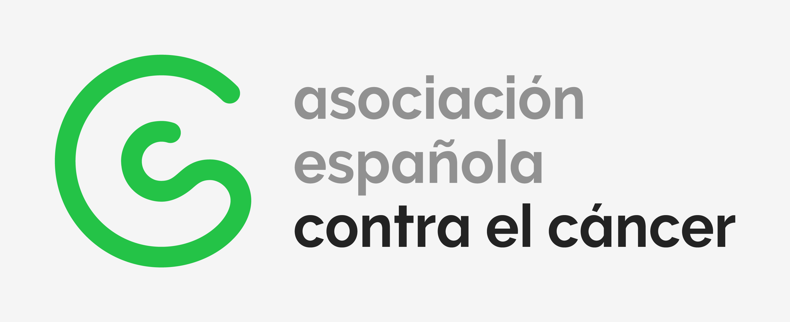
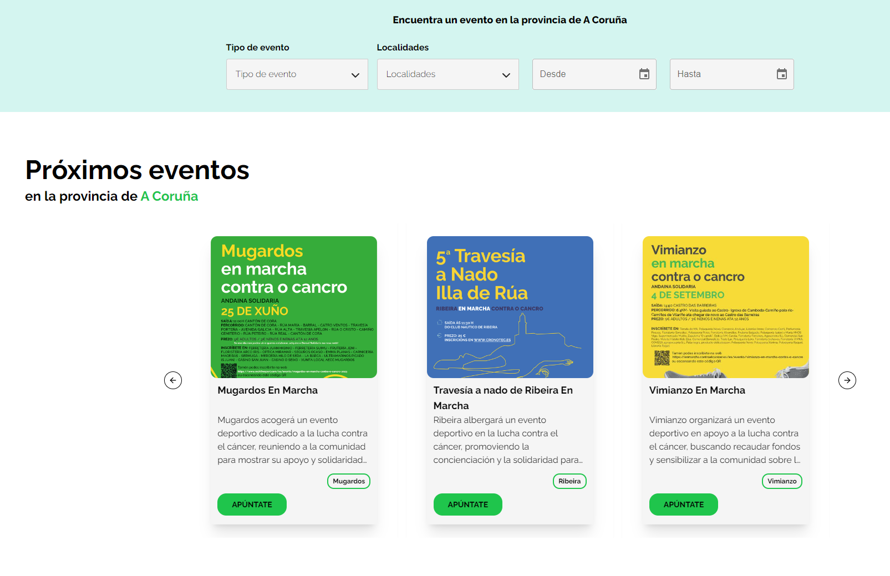
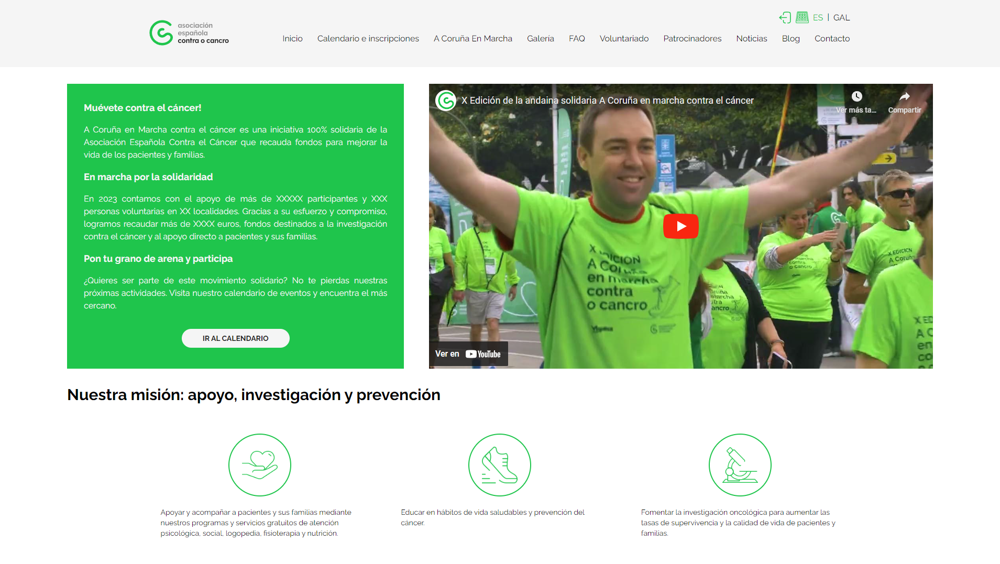
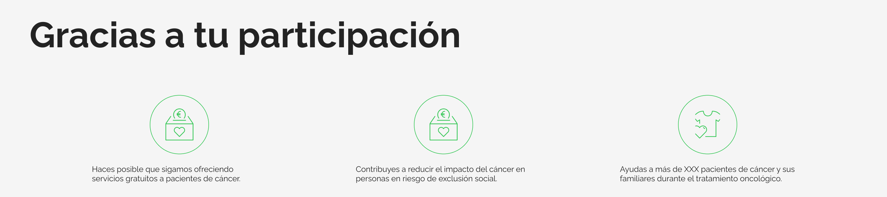
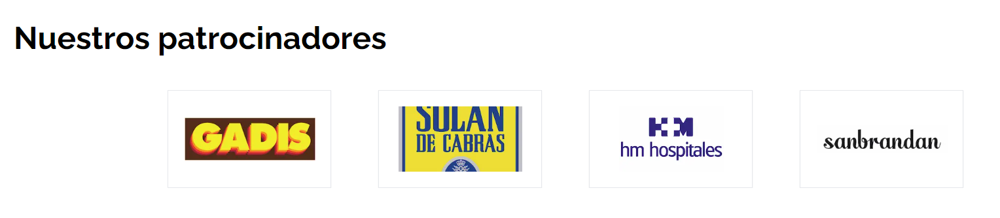
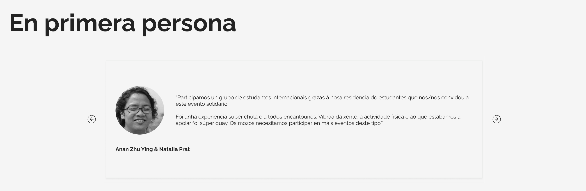
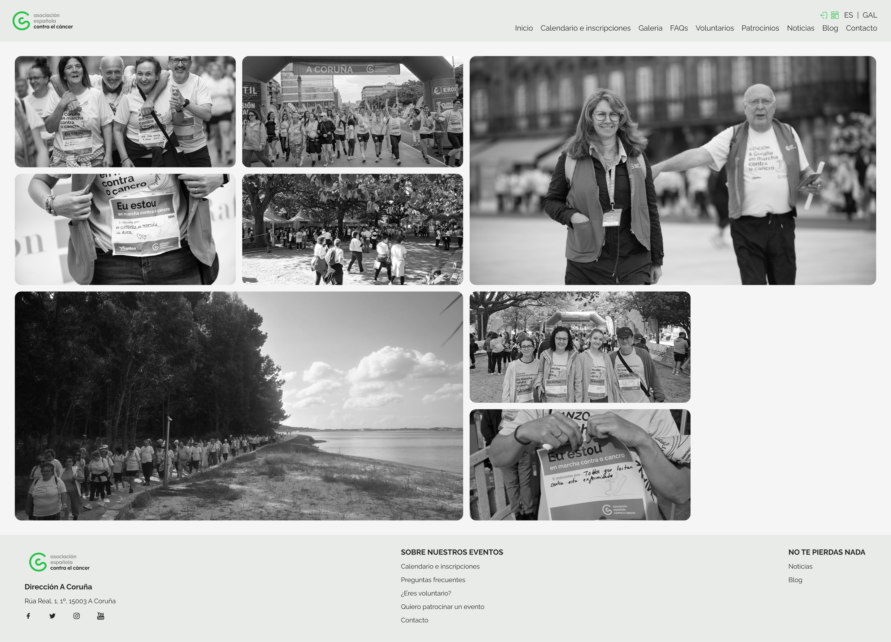
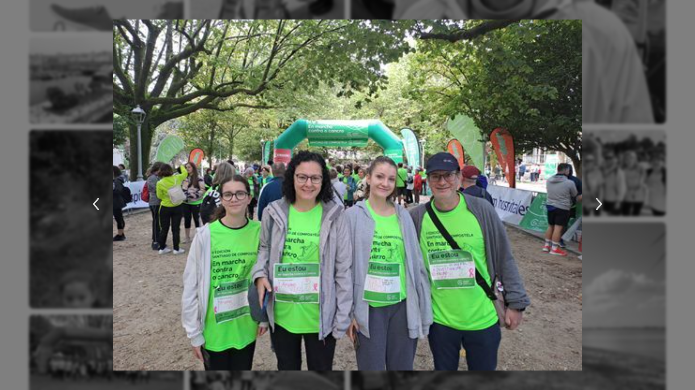
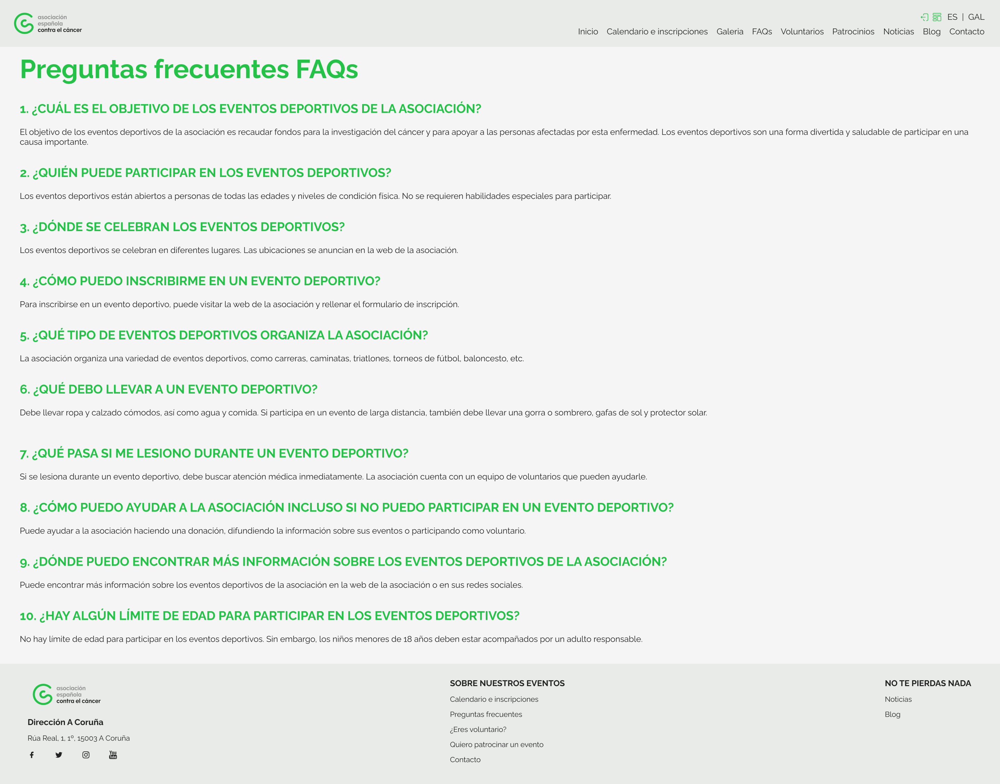
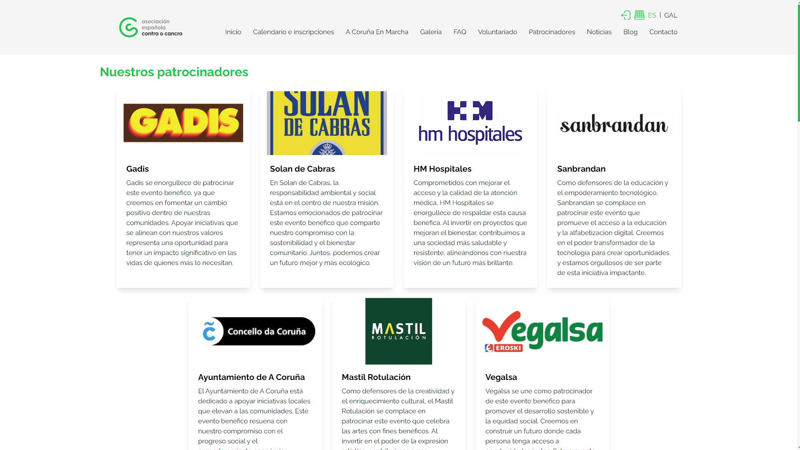

# AECC A Coruña 💚

<div>
  
</div>

<br/>

_La Asociación Española Contra el Cáncer (AECC) de A Coruña desea realizar una página web para promocionar eventos y actividades deportivas._

<ol id='menu'>
  <li>
    <a href='#📋-descripción'>Descripción</a>
  </li>
  <li>
    <a href="#⚙-inicialización">Inicialización</a>
    <ul>
      <li><a href='#instalación'>Instalación</a></li>
      <li>
        <a href='#endpoints'>Endpoints</a>
        <ul>
          <a href="#administrador">
            <li>Administrador</li>
          </a>
          <a href="#banners">
            <li>Banners</li>
          </a>
          <a href="#eventos">
            <li>Eventos</li>
          </a>
          <a href="#patrocinadores">
            <li>Patrocinadores</li>
          </a>
          <a href="#logros">
            <li>Logros</li>
          </a>
          <a href="#experiencias">
            <li>Experiencias</li>
          </a>
          <a href="#preguntas-frecuentes">
            <li>Preguntas frecuentes</li>
          </a>
          <a href="#noticias">
            <li>Noticias</li>
          </a>
        </ul>
      </li>
    </ul>
  </li>
  <li>
    <a href="#🎨-diseño">Diseño</a>
  </li>
  <li>
    <a href="#👩‍💻-autores">Autores</a>
  </li>
  <li>
    <a href="#💻-tech-stack">Tecnologías utilizadas</a>
  </li>
</ol>

## 📋 Descripción
- Los usuarios pueden:
  - Ver los próximos eventos deportivos organizados por la Asociación, pudiendo filtrar según sus preferencias, seleccionando el tipo de evento, la localización y/o las fechas del mismo.
  
    

  - Ser redireccionados a la página del evento en el que estén interesados para ver los detalles del evento y efectuar la inscripción.
  - Obtener información sobre la misión de la Asociación y sus objetivos con la iniciativa "En Marcha".
  
    

  - Conocer los últimos logros obtenidos por la Asociación así como una breve descripción de cada uno de ellos.
  
    

  - Ver los patrocinadores principales de los eventos En Marcha de la provincia de A Coruña.
  
    
  
  - Leer experiencias de participantes en anteriores ediciones de eventos En Marcha contra el cáncer.
  
    

  - Visualizar fotos de anteriores eventos en una galería creada con el estilo **Bento Grid** y visualización individual de las mismas en una modal.
  
    
    

  - Dar respuesta a dudas comunes en relación a los eventos a través de una sección de preguntas frecuentes.

    

  - Ponerse en contacto con la Asociación para ofrecerse a colaborar como voluntario en los eventos.
  
    

  - Conocer a los patrocinadores actuales del circuito y el motivo que los anima a colaborar, así como solicitar ser empresa patrocinadora para eventos. 
  
     
    
  
  - Noticias
  - Blog
  - Contacto

- El usuario admin puede:
  - Añadir/modificar/borrar eventos (fotografía, fechas, link con más información, ubicación, descripción y título).
  - Añadir/borrar fotos del evento 
  - Modificar sus credenciales de acceso.
  - Añadir/modificar/borrar faqs
  - Añadir/modificar/borrar patrocinios
  - Añadir/modificar/borrar noticias
  - Añadir/modificar/borrar experiencias
  - Añadir/modificar/borrar logros
  - Añadir/modificar/borrar banner
  
<a href="#menu">Volver arriba</a>

## ⚙ Inicialización
Para inicializar la app debes seguir los siguientes pasos:

### Instalación
- Clonar el repositorio:
  
  ```
  git clone git@github.com:AnaBelenBernardez/aecc.git
  ```

- Cambiar a la carpeta `server` e instalar las dependencias necesarias:
  
  ```
  cd server/
  npm i
  ```

- Añadir un archivo `.env` cumplimentando los datos aportados en el archivo `.env.example` como ejemplo

- Arrancar el servidor
  
  ```
  npm run dev
  ```

- En otra terminal cambiamos a la carpeta `client` e instalamos las dependencias necesarias
  
  ```
  cd client/
  npm i
  ```

- Añadir un archivo `.env` cumplimentando los datos aportados en el archivo `.env.example` como ejemplo

- Arrancar el servidor

  ```
  npm run dev
  ```

  <a href="#menu">Volver arriba</a>

### Endpoints
#### Administrador
<table style="border: 1px white solid">
	<tbody>
		<tr>
			<td style="border: 1px gray solid; font-weight: bold">METHOD</td>
			<td style="border: 1px gray solid; font-weight: bold">URL</td>
			<td style="border: 1px gray solid; font-weight: bold">DESCRIPCIÓN</td>
		</tr>
		<tr>
			<td style="border: 1px gray solid">POST</td>
			<td style="border: 1px gray solid">/admin/login</td>
			<td style="border: 1px gray solid">Incio de sesión de usuario</td>
		</tr>
		<tr>
			<td style="border: 1px gray solid">PUT</td>
			<td style="border: 1px gray solid">/admin/update-password/:idAdmin</td>
			<td style="border: 1px gray solid">Modificar la contraseña del usuario administrador</td>
		</tr>
	</tbody>
</table>

#### Banners
<table style="border: 1px white solid">
	<tbody>
		<tr>
			<td style="border: 1px gray solid; font-weight: bold">METHOD</td>
			<td style="border: 1px gray solid; font-weight: bold">URL</td>
			<td style="border: 1px gray solid; font-weight: bold">DESCRIPCIÓN</td>
		</tr>
		<tr>
			<td style="border: 1px gray solid">GET</td>
			<td style="border: 1px gray solid">/banners/</td>
			<td style="border: 1px gray solid">Obtener todos los banners</td>
		</tr>
    	<tr>
			<td style="border: 1px gray solid">GET</td>
			<td style="border: 1px gray solid">/banners/:idBanner</td>
			<td style="border: 1px gray solid">Obtener un banner según su ID</td>
		</tr>
		<tr>
			<td style="border: 1px gray solid">POST</td>
			<td style="border: 1px gray solid">/banners/admin/add</td>
			<td style="border: 1px gray solid">Añadir un nuevo banner</td>
		</tr>
		<tr>
			<td style="border: 1px gray solid">PUT</td>
			<td style="border: 1px gray solid">/banners/admin/edit/:idBanner</td>
			<td style="border: 1px gray solid">Editar un banner existente</td>
		</tr>
    <tr>
			<td style="border: 1px gray solid">DELETE</td>
			<td style="border: 1px gray solid">/banners/admin/delete/:idBanner</td>
			<td style="border: 1px gray solid">Borrar un banner</td>
		</tr>
    <tr>
			<td style="border: 1px gray solid">DELETE</td>
			<td style="border: 1px gray solid">/banners/admin/:idBanner/delete/photo/:idPhoto</td>
			<td style="border: 1px gray solid">Borrar la foto de un banner</td>
		</tr>
	</tbody>
</table>

#### Eventos
<table style="border: 1px white solid">
	<tbody>
		<tr>
			<td style="border: 1px gray solid; font-weight: bold">METHOD</td>
			<td style="border: 1px gray solid; font-weight: bold">URL</td>
			<td style="border: 1px gray solid; font-weight: bold">DESCRIPCIÓN</td>
		</tr>
		<tr>
			<td style="border: 1px gray solid">GET</td>
			<td style="border: 1px gray solid">/events/</td>
			<td style="border: 1px gray solid">Obtener todos los eventos</td>
		</tr>
		<tr>
			<td style="border: 1px gray solid">GET</td>
			<td style="border: 1px gray solid">/events/:idEvent</td>
			<td style="border: 1px gray solid">Obtener un evento según su ID</td>
		</tr>
		<tr>
			<td style="border: 1px gray solid">POST</td>
			<td style="border: 1px gray solid">/events/admin/add</td>
			<td style="border: 1px gray solid">Añadir un nuevo evento</td>
		</tr>
    <tr>
			<td style="border: 1px gray solid">POST</td>
			<td style="border: 1px gray solid">/events/admin/add-photo/:idEvent</td>
			<td style="border: 1px gray solid">Añadir una nueva foto al evento</td>
		</tr>
		<tr>
			<td style="border: 1px gray solid">PUT</td>
			<td style="border: 1px gray solid">/events/admin/edit/:idEvent</td>
			<td style="border: 1px gray solid">Editar un evento existente</td>
		</tr>
    <tr>
			<td style="border: 1px gray solid">DELETE</td>
			<td style="border: 1px gray solid">/events/admin/delete/:idEvent</td>
			<td style="border: 1px gray solid">Borrar un evento</td>
		</tr>
    <tr>
			<td style="border: 1px gray solid">DELETE</td>
			<td style="border: 1px gray solid">/events/admin/:idEvent/delete/photo/:idPhoto</td>
			<td style="border: 1px gray solid">Borrar una foto de un evento</td>
		</tr>
	</tbody>
</table>

#### Patrocinadores
<table style="border: 1px white solid">
	<tbody>
		<tr>
			<td style="border: 1px gray solid; font-weight: bold">METHOD</td>
			<td style="border: 1px gray solid; font-weight: bold">URL</td>
			<td style="border: 1px gray solid; font-weight: bold">DESCRIPCIÓN</td>
		</tr>
		<tr>
			<td style="border: 1px gray solid">GET</td>
			<td style="border: 1px gray solid">/sponsors/</td>
			<td style="border: 1px gray solid">Obtener todos los patrocinadores</td>
		</tr>
		<tr>
			<td style="border: 1px gray solid">GET</td>
			<td style="border: 1px gray solid">/sponsors/:idSponsor</td>
			<td style="border: 1px gray solid">Obtener un patrocinador según su ID</td>
		</tr>
		<tr>
			<td style="border: 1px gray solid">POST</td>
			<td style="border: 1px gray solid">/sponsors/admin/add</td>
			<td style="border: 1px gray solid">Añadir un nuevo patrocinador</td>
		</tr>
		<tr>
			<td style="border: 1px gray solid">PUT</td>
			<td style="border: 1px gray solid">/sponsors/admin/edit/:idSponsor</td>
			<td style="border: 1px gray solid">Editar un patrocinador existente</td>
		</tr>
    <tr>
			<td style="border: 1px gray solid">DELETE</td>
			<td style="border: 1px gray solid">/sponsors/admin/delete/:idSponsor</td>
			<td style="border: 1px gray solid">Borrar un patrocinador</td>
		</tr>
	</tbody>
</table>

#### Logros
<table style="border: 1px white solid">
	<tbody>
		<tr>
			<td style="border: 1px gray solid; font-weight: bold">METHOD</td>
			<td style="border: 1px gray solid; font-weight: bold">URL</td>
			<td style="border: 1px gray solid; font-weight: bold">DESCRIPCIÓN</td>
		</tr>
		<tr>
			<td style="border: 1px gray solid">GET</td>
			<td style="border: 1px gray solid">/achievements/</td>
			<td style="border: 1px gray solid">Obtener todos los logros</td>
		</tr>
		<tr>
			<td style="border: 1px gray solid">GET</td>
			<td style="border: 1px gray solid">/achievements/:idAchievement</td>
			<td style="border: 1px gray solid">Obtener un logro según su ID</td>
		</tr>
		<tr>
			<td style="border: 1px gray solid">POST</td>
			<td style="border: 1px gray solid">/achievements/admin/add</td>
			<td style="border: 1px gray solid">Añadir un nuevo logro</td>
		</tr>
		<tr>
			<td style="border: 1px gray solid">PUT</td>
			<td style="border: 1px gray solid">/achievments/admin/edit/:idAchievement</td>
			<td style="border: 1px gray solid">Editar un logro existente</td>
		</tr>
    <tr>
			<td style="border: 1px gray solid">DELETE</td>
			<td style="border: 1px gray solid">/events/admin/delete/:idAchievement</td>
			<td style="border: 1px gray solid">Borrar un logro</td>
		</tr>
	</tbody>
</table>

#### Experiencias
<table style="border: 1px white solid">
	<tbody>
		<tr>
			<td style="border: 1px gray solid; font-weight: bold">METHOD</td>
			<td style="border: 1px gray solid; font-weight: bold">URL</td>
			<td style="border: 1px gray solid; font-weight: bold">DESCRIPCIÓN</td>
		</tr>
		<tr>
			<td style="border: 1px gray solid">GET</td>
			<td style="border: 1px gray solid">/experiences/</td>
			<td style="border: 1px gray solid">Obtener todas las experiencias</td>
		</tr>
		<tr>
			<td style="border: 1px gray solid">POST</td>
			<td style="border: 1px gray solid">/experiences/admin/add</td>
			<td style="border: 1px gray solid">Añadir una nueva experiencia</td>
		</tr>
		<tr>
			<td style="border: 1px gray solid">PUT</td>
			<td style="border: 1px gray solid">/experiences/admin/edit/:idExperience</td>
			<td style="border: 1px gray solid">Editar una experiencia existente</td>
		</tr>
    <tr>
			<td style="border: 1px gray solid">DELETE</td>
			<td style="border: 1px gray solid">/experiences/admin/delete/:idExperience</td>
			<td style="border: 1px gray solid">Borrar una experiencia</td>
		</tr>
	</tbody>
</table>

#### Preguntas frecuentes
<table style="border: 1px white solid">
	<tbody>
		<tr>
			<td style="border: 1px gray solid; font-weight: bold">METHOD</td>
			<td style="border: 1px gray solid; font-weight: bold">URL</td>
			<td style="border: 1px gray solid; font-weight: bold">DESCRIPCIÓN</td>
		</tr>
		<tr>
			<td style="border: 1px gray solid">GET</td>
			<td style="border: 1px gray solid">/faqs/</td>
			<td style="border: 1px gray solid">Obtener todas las preguntas frecuentes</td>
		</tr>
    	<tr>
			<td style="border: 1px gray solid">GET</td>
			<td style="border: 1px gray solid">/faqs/:idFaq</td>
			<td style="border: 1px gray solid">Obtener una pregunta frecuente según su ID</td>
		</tr>
		<tr>
			<td style="border: 1px gray solid">POST</td>
			<td style="border: 1px gray solid">/faqs/admin/add</td>
			<td style="border: 1px gray solid">Añadir una nueva pregunta frecuente</td>
		</tr>
		<tr>
			<td style="border: 1px gray solid">PUT</td>
			<td style="border: 1px gray solid">/faqs/admin/edit/:idFaq</td>
			<td style="border: 1px gray solid">Editar una pregunta frecuente existente</td>
		</tr>
    <tr>
			<td style="border: 1px gray solid">DELETE</td>
			<td style="border: 1px gray solid">/faqs/admin/delete/:idFaq</td>
			<td style="border: 1px gray solid">Borrar una pregunta frecuente</td>
		</tr>
	</tbody>
</table>

#### Noticias
<table style="border: 1px white solid">
	<tbody>
		<tr>
			<td style="border: 1px gray solid; font-weight: bold">METHOD</td>
			<td style="border: 1px gray solid; font-weight: bold">URL</td>
			<td style="border: 1px gray solid; font-weight: bold">DESCRIPCIÓN</td>
		</tr>
		<tr>
			<td style="border: 1px gray solid">GET</td>
			<td style="border: 1px gray solid">/news/</td>
			<td style="border: 1px gray solid">Obtener todas las noticias</td>
		</tr>
    	<tr>
			<td style="border: 1px gray solid">GET</td>
			<td style="border: 1px gray solid">/news/:idNews</td>
			<td style="border: 1px gray solid">Obtener una noticia según su ID</td>
		</tr>
		<tr>
			<td style="border: 1px gray solid">POST</td>
			<td style="border: 1px gray solid">/news/admin/add</td>
			<td style="border: 1px gray solid">Añadir una nueva noticia</td>
		</tr>
		<tr>
			<td style="border: 1px gray solid">PUT</td>
			<td style="border: 1px gray solid">/news/admin/edit/:idNews</td>
			<td style="border: 1px gray solid">Editar una noticia existente</td>
		</tr>
    <tr>
			<td style="border: 1px gray solid">DELETE</td>
			<td style="border: 1px gray solid">/news/admin/delete/:idNews</td>
			<td style="border: 1px gray solid">Borrar una noticia</td>
		</tr>
    <tr>
			<td style="border: 1px gray solid">DELETE</td>
			<td style="border: 1px gray solid">/news/admin/:idNews/delete/photo/:idPhoto</td>
			<td style="border: 1px gray solid">Borrar una foto de una noticia</td>
		</tr>
	</tbody>
</table>

<a href="#menu">Volver arriba</a>

## 🎨 Diseño
Diseñada con [Figma](https://www.figma.com/file/e8ntkYMBhjdPdk01BjmB03/Aecc?type=design&node-id=0-1&mode=design&t=9WMaVyOFBZSGwEOO-0) para mejorar así la planificación de la App y poder comprender los datos necesarios y la manera más efectiva de representarlos, pudiendo mantener una coherencia visual y funcional en todo el desarrollo.

Responsive, amigable y facilmente accesible desde multiples dispositivos. Cumpliendo criterios de accesibilidad para que pueda ser usada por culquier persona.


## 👩‍💻 Autores
<a href="https://github.com/AnaBelenBernardez/aecc/graphs/contributors">
  
</a>

<br/>

## 💻 Tech Stack
<div align="center">

  
  
  
  
  
  
  
  
  
  
  
  
  
  
  
  
  
  

</div>

<a href="#menu">Volver arriba</a>