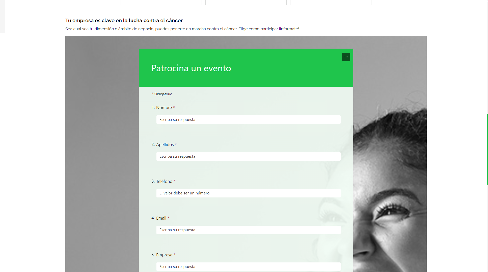

# AECC A Coruña 💚

  

 

_La Asociación Española Contra el Cáncer (AECC) de A Coruña desea realizar una página web para promocionar eventos y actividades deportivas._

## 📋 Descripción

- Los usuarios pueden:
  - Ver los próximos eventos deportivos organizados por la Asociación, pudiendo filtrar según sus preferencias, seleccionando el tipo de evento, la localización y/o las fechas del mismo.
  
    

  - Ser redireccionados a la página del evento en el que estén interesados para ver los detalles del evento y efectuar la inscripción.
  - Obtener información sobre la misión de la Asociación y sus objetivos con la iniciativa "En Marcha".
  
    

  - Conocer los últimos logros obtenidos por la Asociación así como una breve descripción de cada uno de ellos.
  
    

  - Ver los patrocinadores principales de los eventos En Marcha de la provincia de A Coruña.
  
    
  
  - Leer experiencias de participantes en anteriores ediciones de eventos En Marcha contra el cáncer.
  
    

  - Visualizar fotos de anteriores eventos en una galería creada con el estilo **Bento Grid** y visualización individual de las mismas en una modal.
  
    
    

  - Dar respuesta a dudas comunes en relación a los eventos a través de una sección de preguntas frecuentes.

    

  - Ponerse en contacto con la Asociación para ofrecerse a colaborar como voluntario en los eventos.
  
    

  - Conocer a los patrocinadores actuales del circuito y el motivo que los anima a colaborar, así como solicitar ser empresa patrocinadora para eventos. 
  
     
    
- El usuario admin puede:
  - Añadir eventos (fotografía, fechas, link con más información, ubicación, descripción y título).
  - Modificar eventos.
  - Borrar eventos.
  - Modificar sus credenciales de acceso.

## ⚙ Inicialización

Para inicializar la app debes seguir los siguientes pasos:

 

## 👩‍💻 Autores

 

## 💻 Tech Stack

  
  
  
  
  
  
  
  
  
  
  
  
  
  
  
  
  
  

